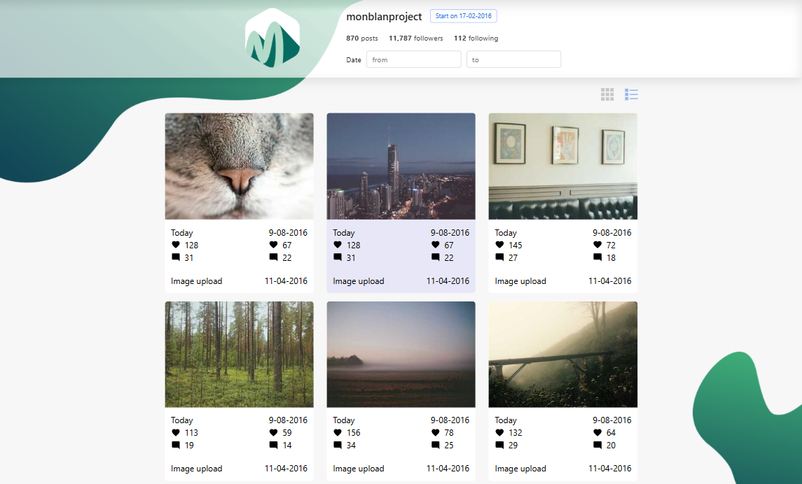

## 🌤️ Monblan App
- A test project implementing a modern profile page inspired by Instagram layout.
- Includes adaptive design, grid/list view toggle, and decorative wave elements in the header and footer.

## ✨ Features
- Two display modes for posts: Grid and List, switchable via buttons.
- Fully responsive layout for desktop, tablet, and mobile screens.
- Decorative “wave” backgrounds with transparency and blur effect.
- Smooth hover and active state animations for buttons and posts.
- Clean structure using BEM naming convention.
 

## 🛠 Tech Stack- 
- React + Vite
- CSS (BEM, responsive design)
- GitHub Pages for deployment

## 📸 Preview


## 🚀 Getting Started

Clone the repo and run locally:

```bash
git clone https://github.com/kozlovoleksii/monblan-app.git
cd name-of-project
npm install
npm run dev